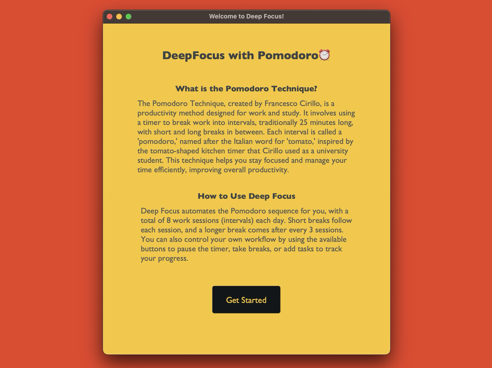
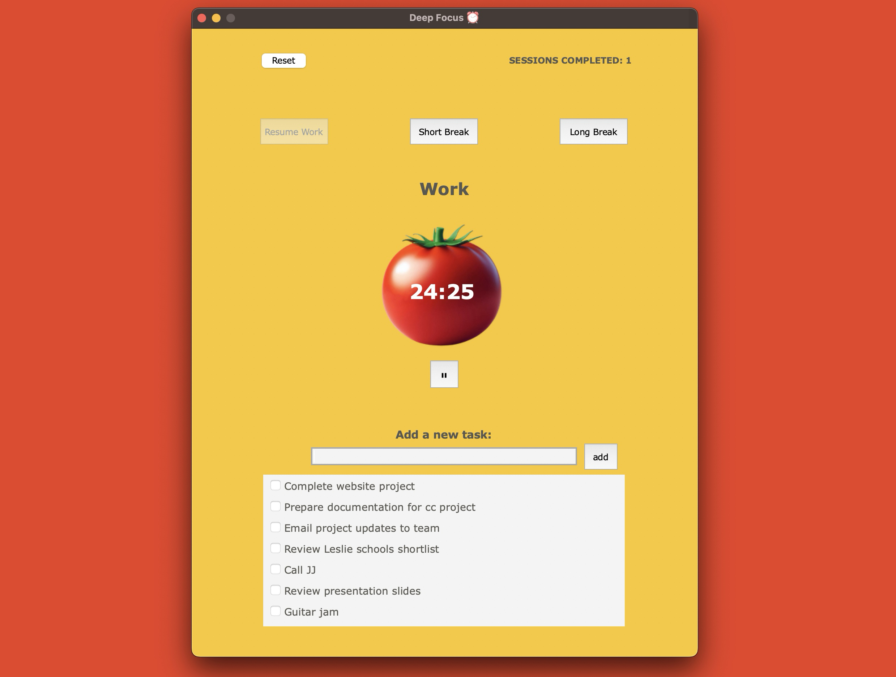
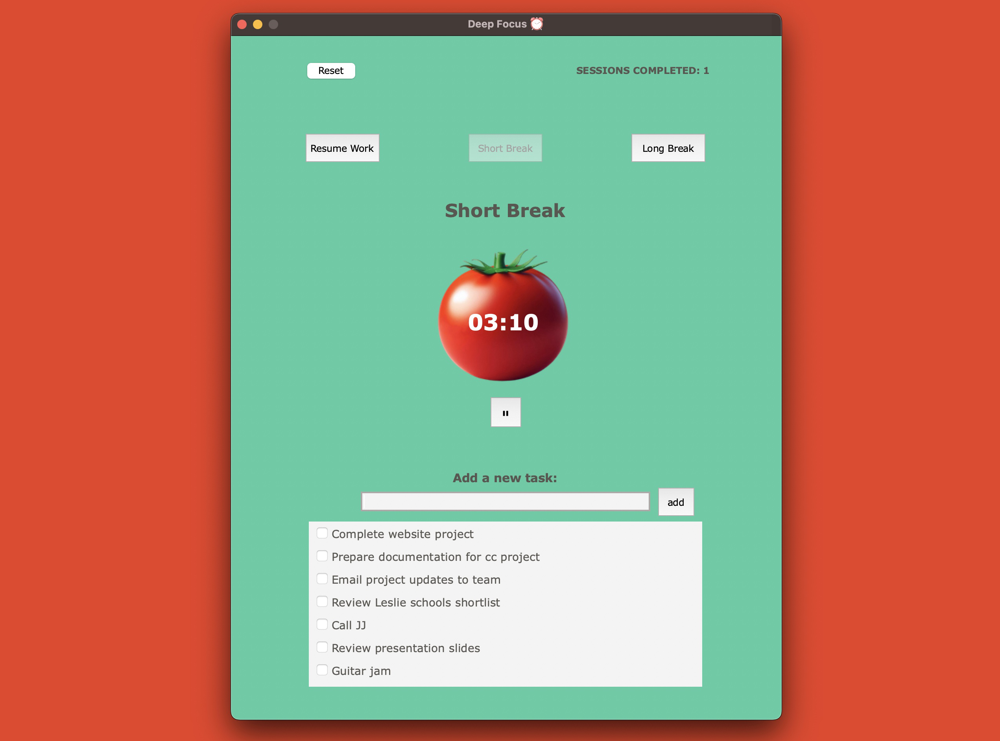
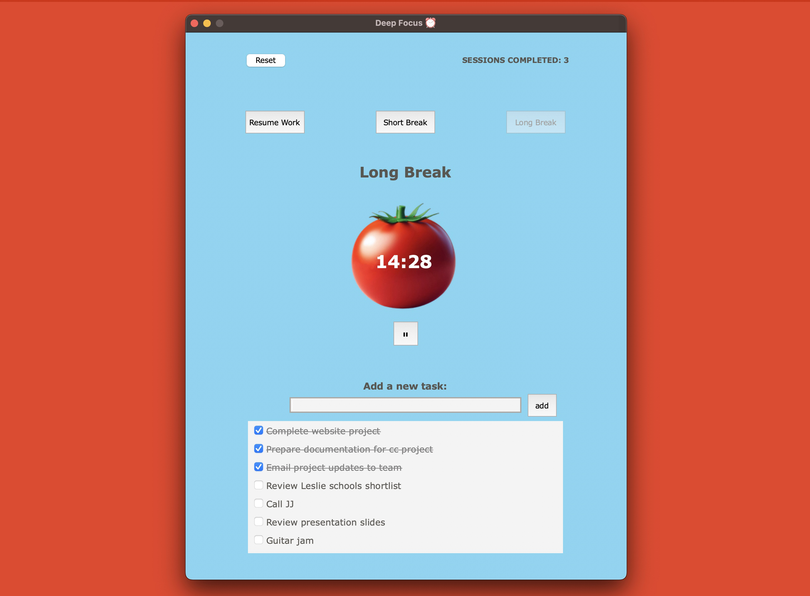

# Deep Focus ⏰

**Deep Focus is a cross-platform Pomodoro timer designed to help you stay productive using the _Pomodoro Technique._ The app automatically manages your work sessions and breaks, making time management easier and more effective.**

## Features

- **Automated Pomodoro Cycles**: Handles up to 8 work sessions with timed breaks.
- **Task Management**: Track tasks during each session.
- **Timer Controls**: Easily start, pause, or reset sessions.
- **Intro Screen**: Explains the Pomodoro technique before starting.

## Dependencies

For macOS button styling, install tkmacosx:

```bash
pip install tkmacosx
```

## Usage

- Run the application with `app.py`.

- Refer to the `app_images` folder for visuals.

## License

MIT License

## Visuals
<table>
<tr>
    <td></td>
    <td></td>
</tr>
<tr>
    <td></td>
    <td></td>
</tr>
</table>


## Author

**Kobby S. Arthur**